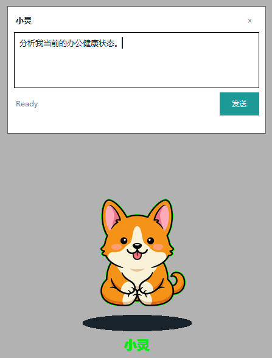
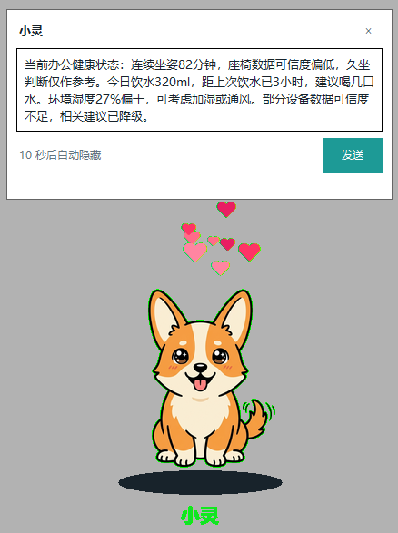

# HealthDesk Agent

面向办公族的健康陪伴 Agent。它不是冷冰冰地弹一个久坐提醒，而是像一只桌面小狗一样，读懂你当前的办公状态，再用温和、可追踪、不过度医疗化的方式提醒你休息、喝水、调整环境。

当前开源版本聚焦一件事：把真实 Agent pipeline 跑通。项目使用 `LangGraph + DeepSeek Function Calling` 构建 ReAct Agent，让模型自己选择工具、观察结果、生成结构化输出，并驱动 Web/Tkinter 桌宠完成交互反馈。

> 注意：本项目是办公健康提醒与情绪陪伴原型，不提供医疗诊断、疾病判断或治疗建议。

## 作品效果

<p align="center">
  
  
</p>

桌宠名叫“小灵”。你可以点击它、拖动它、和它聊天。它会根据 Agent 的最终结构化输出显示办公健康建议；点击时会切换形象并出现小爱心。最新版本支持小/中/大/超大四档大小切换，超大档使用 2 倍等比例缩放；浏览器轻量桌宠可在对话框中直接选择大小，Windows 桌面版可通过右键菜单调整大小。桌面版不局限在浏览器里，可以在 Windows 桌面和副屏之间自由拖动并驻留。

## 为什么做这个项目

久坐、忘记喝水、空调房太干、长时间盯屏幕，这些问题对很多办公族来说都很普通，也很容易被忽略。传统提醒软件通常只有固定闹钟，缺少上下文，也不太会照顾人的感受。

HealthDesk Agent 想做得更普惠一点：

- 让健康提醒不只服务专业运动人群，也能服务每天坐在电脑前工作的普通人。
- 让 Agent 不只“回答问题”，也能主动结合状态、设备可信度和近期事件做判断。
- 让办公健康建议更克制：不吓人、不诊断、不制造焦虑，只给能马上执行的小建议。
- 让 AI 陪伴更落地：最终输出会变成桌宠动作、表情和一句可爱的提醒。

## 核心能力

- 真实 ReAct Agent：基于 `LangGraph + DeepSeek tool calling` 实现模型决策、工具执行、观察回写、最终收束。
- 统一上下文：通过 `AgentState + AIContext` 承载当前状态、近期事件、今日统计、设备健康和 memory summary。
- 健康分析工具：支持久坐、饮水、环境舒适度、生命体征趋势参考、设备可信度分析。
- 复合快路径：`analyze_office_health_snapshot` 一次性生成办公健康快照，减少多轮工具调用带来的等待。
- RAG 知识检索：基于本地 Markdown 知识库，支持 Chroma 向量相似度检索 + BM25 关键词检索融合。
- 结构化输出：最终结果必须通过 `HealthAgentFinalOutput` 校验，前端和桌宠只消费稳定 JSON。
- Guardrails：限制医疗化表达，避免输出诊断、疾病判断、治疗建议等高风险内容。
- Trace 回放：记录模型调用、工具序列、observation、RAG chunks、guardrail 状态、停止原因和延迟。
- 桌宠展示：支持完整 Web dashboard、浏览器轻量桌宠、真实 Windows 桌面桌宠三种模式，并支持大小预设、拖动驻留、点击爱心特效和文本对话。

## 技术栈

```text
Python
FastAPI
SQLite
LangGraph
DeepSeek API
LangChain / langchain-deepseek
Pydantic
RAG
Chroma
JavaScript
Tkinter
Pillow
```

## 当前实现边界

这个仓库是一个可运行的 Agent 原型，不是完整硬件产品。

当前开源版本使用 `simulation` 模块模拟办公状态，并写入 SQLite。真实毫米波雷达、深度相机、水杯、温湿度传感器等硬件接入，可以落在 `raw -> feature -> state` 数据层。Agent 层读取的是统一的 `StateData`、`EventData`、`SensorHealth`，因此后续替换真实采集源时，核心 Agent pipeline 不需要大改。

当前前端交互使用 HTTP 同步接口。WebSocket/SSE 进度推送是后续优化方向，用于让桌宠在 Agent 思考过程中持续显示进度。

## RAG 实现

当前 RAG 已从纯关键词原型升级为可选 Chroma 向量数据库后端。

默认配置是：

```text
RAG_BACKEND=auto
```

`auto` 会优先尝试启用 Chroma hybrid retriever；如果当前环境没有安装 `chromadb`，会自动降级到原来的轻量关键词检索器，保证项目仍然能跑。

Chroma hybrid 版本的检索链路：

```text
Markdown 文档
-> 按标题/空行切 chunk
-> 生成 source/category/chunk_index/content_hash 元数据
-> 写入 Chroma PersistentClient
-> 查询时执行向量相似度检索
-> 同时执行本地 BM25 关键词检索
-> 对 vector score 和 BM25 score 归一化
-> 按权重融合并返回 KnowledgeChunk
```

默认权重：

```text
RAG_HYBRID_VECTOR_WEIGHT=0.65
RAG_HYBRID_BM25_WEIGHT=0.35
RAG_CHROMA_RESET_ON_START=false
```

知识库 category 会用于过滤不同工具的检索范围：

```text
search_health_knowledge -> sedentary / hydration / environment
search_pet_templates    -> pet_dialogue
search_device_docs      -> device
```

重建 Chroma 索引：

```powershell
python scripts\rebuild_rag_index.py
```

如果旧索引文件不可写、损坏，或 Chroma 报出 `attempt to write a readonly database`，可以重置后重建：

```powershell
python scripts\rebuild_rag_index.py --reset
```

当前开源版本为了避免额外模型下载，内置了一个 deterministic hashing embedding function，适合本地演示和 CI。后续可以替换为 bge-m3、sentence-transformers 或云端 embedding 模型，Agent 工具接口不需要变化。

## Agent Pipeline

```text
POST /agent/run
-> LangGraphDeepSeekRuntime
-> LangGraph StateGraph
-> load_context_node
-> DeepSeekReasonNode
-> DeepSeek tool_calls
-> Python tool handlers
-> ToolObservation
-> observe_node
-> submit_final_output
-> HealthAgentFinalOutput
-> guardrails_node
-> save_trace_node
-> SQLite trace
-> Web / Desktop Companion
```

一句话理解：

```text
DeepSeek 负责选择下一步工具，LangGraph 负责把选择变成可控状态机，
Python 工具负责读取事实和执行能力，Pydantic 负责把最终输出收成稳定结构。
```

## 项目结构

```text
app/
  api/                 FastAPI routes
  agent_runtimes/      LangGraph + DeepSeek runtime
  graph/               AgentState、LangGraph 节点、条件边、trace adapter
  agent_tools/         Context/RAG/Analysis/Action/Memory/Handoff tools
  skills/              久坐、饮水、环境、设备、桌宠话术等业务能力
  rag/                 本地 Markdown 知识库与轻量检索器
  memory/              摘要记忆与滑动窗口原型
  schemas/             Pydantic 数据契约
  simulation/          模拟办公状态和设备健康
  storage/             SQLite repository
  static/pet/          Web 桌宠页面
  desktop_companion.py Windows 桌面桌宠入口

pics/                  桌宠素材与作品截图
scripts/               初始化、模拟数据、桌宠启动脚本
tests/                 Agent pipeline 与工具测试
```

## 快速开始

### 1. 创建环境

```powershell
cd P:\AI\HDA\healthdesk_agent
python -m venv .venv
.\.venv\Scripts\Activate.ps1
pip install -r requirements.txt
```

如果你使用的是已有虚拟环境，例如 `.hdagent`，也可以直接激活后安装依赖：

```powershell
.\.hdagent\Scripts\Activate.ps1
pip install -r requirements.txt
```

### 2. 配置 DeepSeek

复制 `.env.example` 为 `.hdagent/.env`，填入你的 API Key。真实 Agent 的本地运行配置统一放在 `.hdagent` 虚拟环境目录中，避免继续使用旧的 `.hda` 目录：

```text
DEEPSEEK_API_KEY=你的 DeepSeek API Key
DEEPSEEK_BASE_URL=https://api.deepseek.com
DEEPSEEK_MODEL=deepseek-v4-flash
DEEPSEEK_THINKING=disabled
DEEPSEEK_REASONING_EFFORT=high

HEALTHDESK_DB_PATH=.hdagent/healthdesk.db
DATABASE_PATH=.hdagent/healthdesk.db
MAX_AGENT_STEPS=6
MAX_SAME_TOOL_CALLS=2
RAG_TOP_K=3
RAG_BACKEND=auto
RAG_CHROMA_PATH=.hdagent/chroma
RAG_CHROMA_COLLECTION=healthdesk_rag
RAG_HYBRID_VECTOR_WEIGHT=0.65
RAG_HYBRID_BM25_WEIGHT=0.35
RAG_EMBEDDING_DIMENSIONS=384
RAG_REBUILD_ON_START=true
RAG_CHROMA_RESET_ON_START=false
TRACE_TO_SQLITE=true

HEALTHDESK_PET_VIEW=dashboard
```

### 3. 初始化数据库并生成一条模拟状态

```powershell
python scripts\init_db.py
python scripts\generate_demo_state.py
```

### 4. 启动服务

```powershell
python -m uvicorn app.main:app --reload --host 127.0.0.1 --port 8000
```

打开：

```text
http://127.0.0.1:8000/pet
```

## 展示模式

### 完整 Web Dashboard

```text
http://127.0.0.1:8000/pet/dashboard
```

适合演示完整链路：场景、Tick、Agent 输入、State、Output、Trace 都在一个页面里。

### 浏览器轻量桌宠

```text
http://127.0.0.1:8000/pet/companion
```

适合展示“点击桌宠唤醒对话框”的交互。发送文本后，Agent 输出会显示 10 秒，然后自动隐藏。

交互能力：

- 左键点击桌宠：唤醒输入框、切换形象、弹出小爱心。
- 拖动桌宠：在浏览器窗口内调整位置。
- 对话框内“小/中/大/超大”：切换桌宠大小。
- 右键桌宠：快捷循环切换大小。
- 位置和大小会保存在浏览器 `localStorage` 中，刷新后继续沿用。

### 真实 Windows 桌面桌宠

```powershell
.\scripts\run_desktop_companion.ps1
```

或者：

```powershell
python -m app.desktop_companion
```

桌面版使用 `tkinter` 实现透明、无边框、置顶窗口：

```text
overrideredirect(True)
attributes("-topmost", True)
attributes("-transparentcolor", "#01FF01")
geometry("+x+y")
```

它支持跨屏拖动，位置会保存到：

```text
.hdagent/desktop_companion_position.json
```

桌面版交互能力：

- 左键点击：唤醒对话框、切换柯基形象、弹出爱心特效。
- 左键拖动：在 Windows 桌面和副屏之间自由移动。
- 右键菜单：支持“摸摸小灵”“隐藏对话”“大小：小/中/大/超大”“再见”。
- 位置、大小和缩放比例会写入 `.hdagent/desktop_companion_position.json`，下次启动自动恢复。

## 常用 API

切换模拟场景：

```powershell
curl -X POST http://127.0.0.1:8000/simulation/scenario/sedentary_high
```

生成一条模拟状态：

```powershell
curl -X POST http://127.0.0.1:8000/simulation/tick
```

查看当前状态：

```powershell
curl http://127.0.0.1:8000/state/current
```

运行真实 Agent：

```powershell
curl -X POST http://127.0.0.1:8000/agent/run `
  -H "Content-Type: application/json" `
  -d "{\"task\":\"分析我当前办公健康状态，并生成桌宠提醒\",\"user_id\":\"default\"}"
```

查看最近 trace：

```powershell
curl http://127.0.0.1:8000/traces/recent
```

查看指定 trace：

```powershell
curl http://127.0.0.1:8000/traces/{trace_id}
```

## 面试讲述亮点

如果你想快速理解这个项目的工程价值，可以重点看这几个点：

1. 真实 Agent，而不是规则假装 Agent

   Python 不用 if/else 决定该调用哪个健康工具。工具选择来自 DeepSeek 的 `tool_calls`，LangGraph 负责状态迁移和停止条件。

2. 上下文边界清楚

   当前状态只能来自 `AIContext`、SQLite 状态工具或 sensor health 工具。RAG 只提供知识依据，不替代当前事实。

3. 输出可消费

   最终输出不是一段随意文本，而是 `HealthAgentFinalOutput`。这让 Web 页面、桌面宠物和 trace 都能稳定消费。

4. 可观测性完整

   Trace 会记录模型调用、工具调用、observation、RAG chunks、guardrail 状态和停止原因，方便复盘 Agent 为什么这样回答。

5. 有真实交互外壳

   Agent 最终能驱动桌宠，而不是停留在命令行 demo。Web 和桌面端都能展示用户可感知的陪伴效果。

## 测试

```powershell
python -m pytest
```

测试覆盖工具注册、结构化输出、RAG、Skills、LangGraph runtime、handoff 和 direct answer 等关键路径。

## Roadmap

- 接入真实传感器数据层，替换当前 simulation。
- 增加 SSE 进度事件，让桌宠展示 Agent 思考进度。
- 将 SimpleRetriever 替换为 FAISS、Milvus 或云向量检索。
- 引入 LLM memory summarizer，完善长期偏好记忆。
- 扩展视距、用眼疲劳、姿态稳定性等办公健康 Skill。
- 增强 Guardrails，从关键词检查升级为策略分类或二次模型校验。
- 增加桌宠动作队列、优先级和打断机制。

## 开源说明

欢迎把这个项目当作一个 Agent 工程样板来阅读：

- 如何把 LLM tool calling 接进 LangGraph。
- 如何设计 AgentState、AIContext、ToolObservation 和最终输出 Schema。
- 如何把业务能力拆成可扩展 Skills。
- 如何让 Agent 输出真正驱动一个可见、可交互的产品界面。

本项目仍在持续迭代中。如果你也关心“AI 如何更自然地照顾普通人的日常健康”，欢迎 fork、试跑和改造,欢迎带着建议或者好的想法联系我(plusl@qq.com)。
